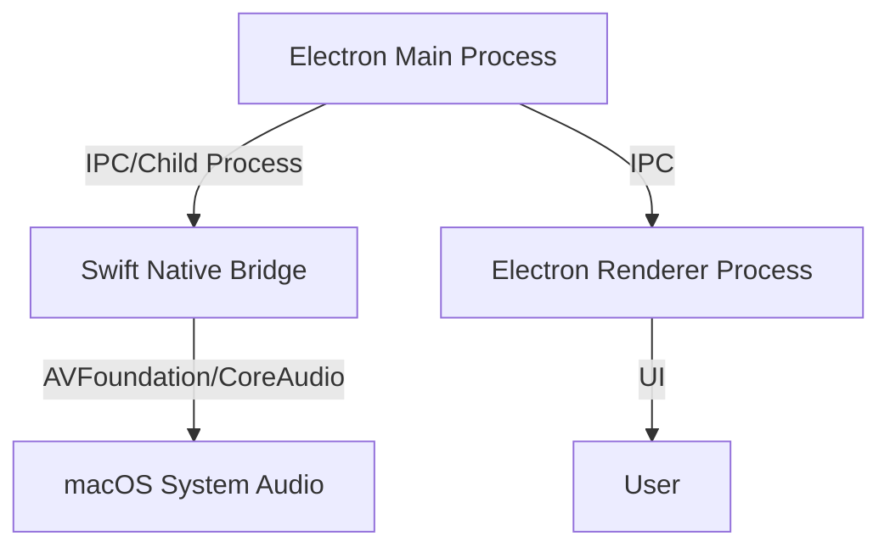

# System Audio-Only Recorder for macOS

## Demo

<video src="demo.mov" controls width="600">
  Your browser does not support the video tag.
</video>

## Problem Statement

Modern browsers do not allow direct recording of system audio for privacy reasons. This project provides a native solution for recording only system audio (excluding the microphone) on macOS, using Electron and Swift.

## System Design

- **Electron** provides the cross-platform UI and orchestrates the recording process.
- **Swift** (via ScreenCaptureKit or Core Audio) captures system audio natively.
- **IPC** connects the Electron renderer (UI) to the main process, which controls the Swift recorder.

### Architecture Overview



**Components:**

- **Electron Main Process:** Orchestrates the application, spawns the Swift process, and handles IPC between renderer and native code.
- **Swift Native Bridge:** A command-line tool or script that uses AVFoundation, ScreenCaptureKit, or Core Audio APIs to capture system audio.
- **Electron Renderer Process:** Provides the user interface for starting/stopping recording and saving audio files.
- **macOS System Audio:** The source of audio to be captured (excluding microphone input).

## Swift Snippet for System Audio-Only Capture

Below is a Swift snippet using ScreenCaptureKit (macOS 12+) to capture system audio. For older macOS versions, Core Audio tap APIs or third-party virtual audio drivers (like BlackHole or Loopback) may be required.

```swift
import Foundation
import ScreenCaptureKit
import AVFoundation

@main
struct SystemAudioRecorder {
    static func main() async {
        let audioConfig = SCStreamConfiguration()
        audioConfig.capturesAudio = true
        audioConfig.capturesVideo = false

        // Exclude microphone by default; only system audio is captured
        let filter = SCContentFilter(desktopIndependentWindow: nil, exceptingWindows: [])
        let stream = try! SCStream(filter: filter, configuration: audioConfig, delegate: nil)

        // Set up output file
        let outputURL = URL(fileURLWithPath: "system_audio.m4a")
        let writer = try! AVAssetWriter(outputURL: outputURL, fileType: .m4a)
        // ... configure writer input with stream audio format ...

        // Start capture
        try! await stream.startCapture()
        print("Recording system audio... Press Ctrl+C to stop.")

        // Handle audio buffers and write to file...
        // (Full implementation would handle buffer callbacks and AVAssetWriter)
    }
}
```

**Note:** For production, handle errors, permissions, and buffer writing. For older macOS, use Core Audio APIs with a virtual audio device.

## Electron Integration

### How Electron Spawns and Controls the Swift Process

- **Spawning:** Electron’s main process uses Node.js `child_process.spawn` to launch the Swift CLI tool.
- **Control:** Electron sends start/stop commands to the Swift process and listens for output (e.g., progress, errors).
- **Streaming:** The Swift tool can write audio data to a file or stream via stdout, which Electron can pipe to the renderer or save.

**Example (Node.js/Electron Main):**
```js
const { spawn } = require('child_process');
let recorderProcess = null;

function startRecording() {
  recorderProcess = spawn('./Recorder'); // Path to compiled Swift binary
  recorderProcess.stdout.on('data', (data) => {
    // Optionally stream data to renderer
  });
  recorderProcess.stderr.on('data', (data) => {
    console.error(`Recorder error: ${data}`);
  });
}

function stopRecording() {
  if (recorderProcess) {
    recorderProcess.kill('SIGINT');
    recorderProcess = null;
  }
}
```

- **IPC:** Use Electron’s IPC to connect renderer UI actions (start/stop) to these functions in the main process.

## Prerequisites

- macOS 12+ (for ScreenCaptureKit; for older versions, see notes below)
- [pnpm](https://pnpm.io/) for managing Node.js dependencies
- Xcode/Swift toolchain for building the native recorder

## Setup

1. **Install dependencies:**
   ```sh
   pnpm install
   ```

2. **Build the Swift recorder:**
   ```sh
   cd src/swift
   swiftc Recorder.swift -o ../Recorder
   cd ../..
   ```

3. **Run the Electron app:**
   ```sh
   pnpm start
   ```

## Usage

- Click "Start Recording" in the UI to begin capturing system audio.
- Click "Stop Recording" to end and save the audio file.

## Implementation Details

- The Electron main process spawns the Swift binary as a child process.
- The Swift tool uses ScreenCaptureKit to capture system audio only.
- Audio is saved as `system_audio.m4a` in the project directory.

## Notes

- **System audio capture** may require user permissions (Screen Recording, Microphone) in System Preferences.
- For macOS versions < 12, you may need to use a virtual audio device (e.g., BlackHole, Loopback) and Core Audio APIs.
- The current implementation does not mix in microphone input.

## References

- [ScreenCaptureKit Documentation](https://developer.apple.com/documentation/screencapturekit)
- [Electron Documentation](https://www.electronjs.org/docs)
- [Core Audio Programming Guide](https://developer.apple.com/library/archive/documentation/MusicAudio/Conceptual/CoreAudioOverview/Introduction/Introduction.html) 